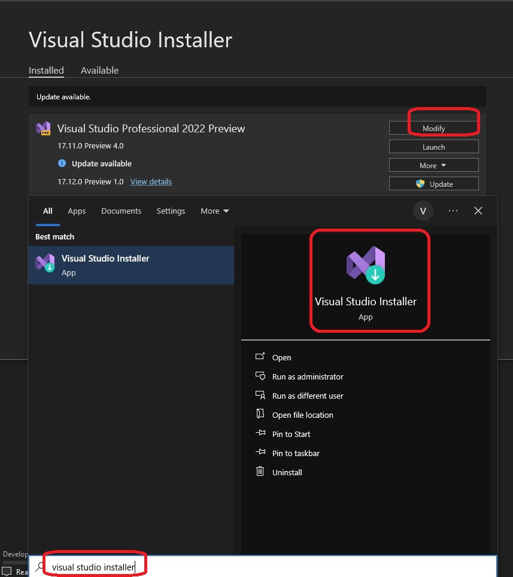
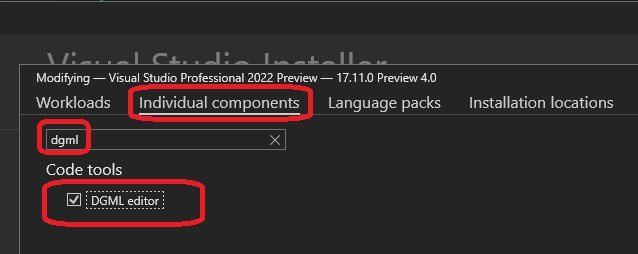

# Getting Read for Dgml 

1. Shows how to set up and get ready for Dgml

## Notes

1. Ensure Visual Studio 2022 or higher is installed.
2. On your windows machine, Press Ctrl + R and then seach for Visual Studio Installer, launch it and click modify 

3. Ensure dgml is installe. Click Individual components, seach for dgml, select and click Modify button on the bottom right(not shown)

4. 