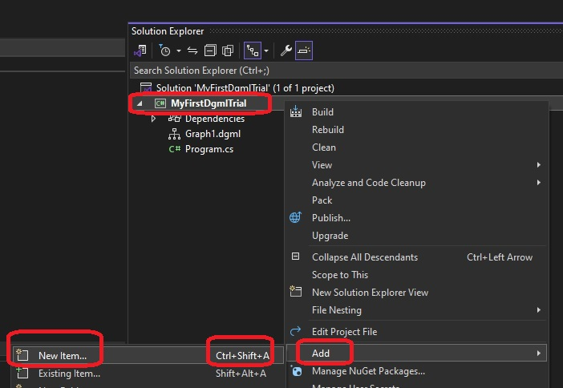
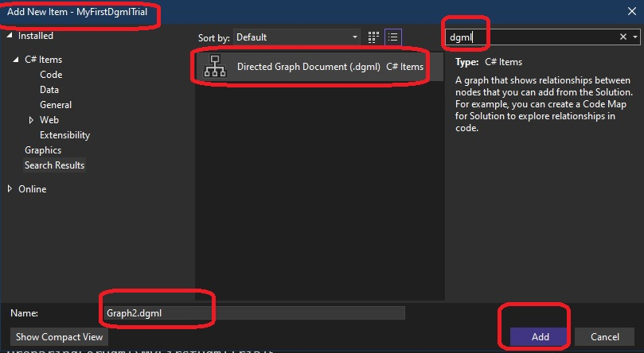
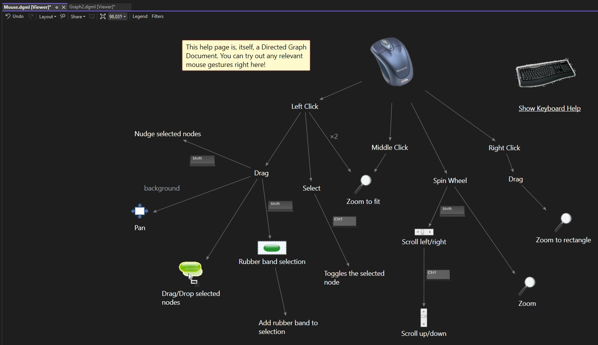

# Getting Read for Dgml 

1. Shows how to set up and get ready for Dgml

## Notes

1. Ensure Visual Studio 2022 or higher is installed.

2. On your windows machine, Press Ctrl + R and then seach for Visual Studio Installer, launch it and click modify 

3. Ensure dgml is installed. Click Individual components, seach for dgml, select and click Modify button on the bottom right(not shown)

4. Now open Visual Studio 2022
   1. Create a new C# console application
   2. Add a new dgml file to that project. `Ctrl + Shift + A`
   3. 

5. In the top right seach box, type dgml, and select dgml file. 

6. A new dgml file opens. To learn more about how to navigate a dgml file using `mouse` and `keyboard`, click the mouse or keyboard links as below.

7. Clicking on Mouse above will take you here as follows. Here we can learn navigating dgml using mouse.

8. Similarly explore keyboard navigation.

9. 