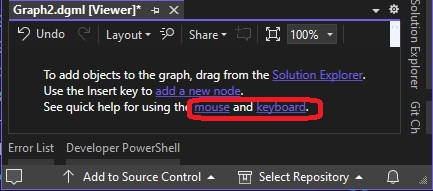
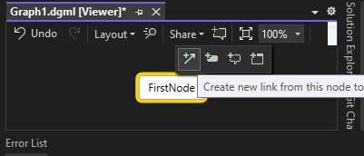
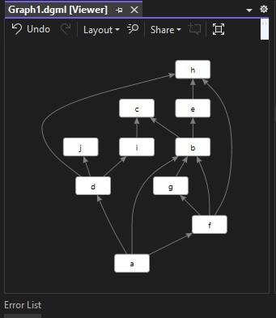
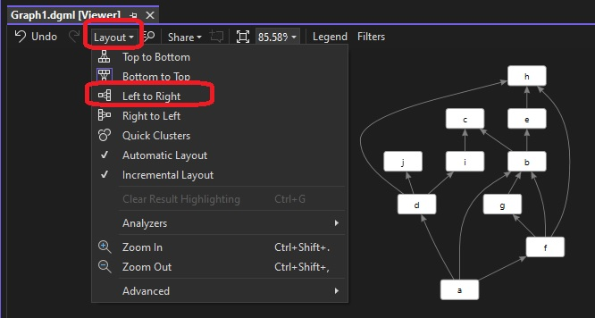

# Exploring dgml file.

## Notes
1. Executes the commands in the commands.sh file, to open the project file.

2. Add a new dgml file.

3. Click `Add a new node` by insert link. Find the following in the image below. 

> Use the insert key to `add a new node`.



4. Middle click the mouse to re arrange the items. Explore creating new nodes and links as follows.



5. Next open the dgml file in vs code. See commands.sh for the command. 

6. Remove any existing nodes and links. Then add the following links. 

7. You can even start completely from scratch, ie. add new dgml file and then add the following links.

```xml
<Links>
    <Link Source="a" Target="b" />
    <Link Source="b" Target="c" />    
    <Link Source="b" Target="e" />    
    <Link Source="a" Target="f" />    
    <Link Source="f" Target="g" />    
    <Link Source="f" Target="h" />    
    <Link Source="a" Target="d" />    
    <Link Source="d" Target="i" />    
    <Link Source="d" Target="j" />
    <Link Source="f" Target="b" />
    <Link Source="g" Target="b" />    
    <Link Source="e" Target="h" />    
    <Link Source="i" Target="c" />    
    <Link Source="d" Target="h" />
</Links> 
```

8. So a bare minimum dgml file looks like the following, with two nodes a and b, a link from a to b.

```xml
<DirectedGraph xmlns="http://schemas.microsoft.com/vs/2009/dgml">
    <Links>
        <Link Source="a" Target="b" />
    </Links>
</DirectedGraph>
```

and with a link and two nodes will be as follows.

```xml
<DirectedGraph xmlns="http://schemas.microsoft.com/vs/2009/dgml">
    <Links>
    </Links>
</DirectedGraph>
```

9. The graph layout alogorith is built in, and its called MSAGL, Microsoft Automatic Graph Layout. 



10. Try with different layouts.



## References
1. 
