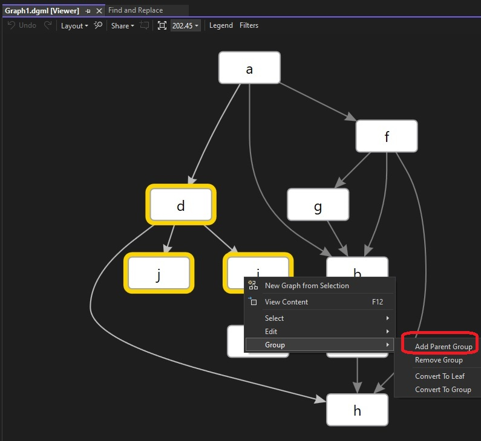
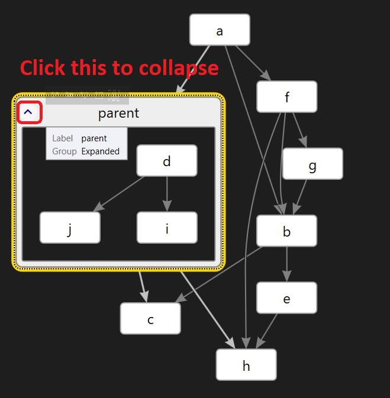

# Exploring dgml file.

## Notes

1. Add the following links.

```xml
<Links>
    <Link Source="a" Target="b" />
    <Link Source="b" Target="c" />    
    <Link Source="b" Target="e" />    
    <Link Source="a" Target="f" />    
    <Link Source="f" Target="g" />    
    <Link Source="f" Target="h" />    
    <Link Source="a" Target="d" />    
    <Link Source="d" Target="i" />    
    <Link Source="d" Target="j" />
    <Link Source="f" Target="b" />
    <Link Source="g" Target="b" />    
    <Link Source="e" Target="h" />    
    <Link Source="i" Target="c" />    
    <Link Source="d" Target="h" />
</Links> 
```

2. Ctrl + Click to select multiple nodes. Select d, i, j. 



3. Name is and save it.



4. Now observe the dgml file in vs code for text changes. A parent id is adde, three new links, and also a category.

```xml
<Node Id="Parent" Bounds="-3.92087878540766,67.4905382113251,170.93856,141.85856" Group="Expanded" Label="parent" />
```

```xml
<Link Source="Parent" Target="d" Category="Contains" />
<Link Source="Parent" Target="i" Category="Contains" />
<Link Source="Parent" Target="j" Category="Contains" />
```

```xml
<Categories>
    <Category Id="Contains" Label="Contains" Description="Whether the source of the link contains the target object" CanBeDataDriven="False" CanLinkedNodesBeDataDriven="True" IncomingActionLabel="Contained By" IsContainment="True" OutgoingActionLabel="Contains" />
</Categories>
```

5. This is an excellent way to collapse complexity in big graphs. 

## References
1. https://youtu.be/wIjCdOrZj-I?t=260
