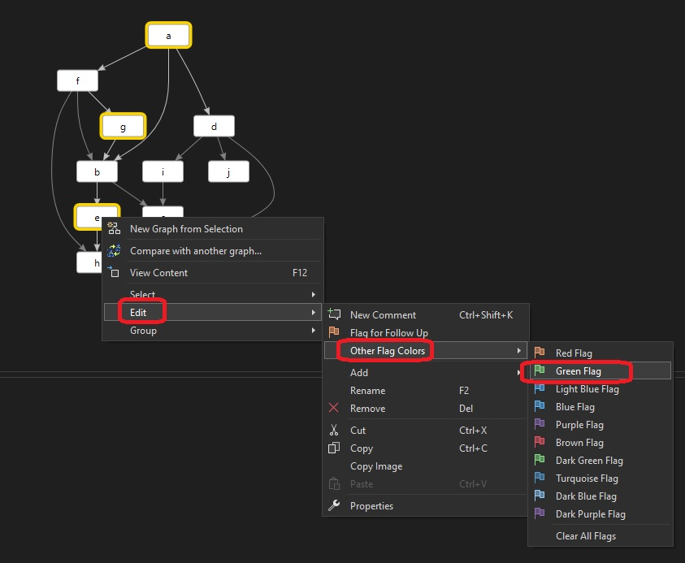
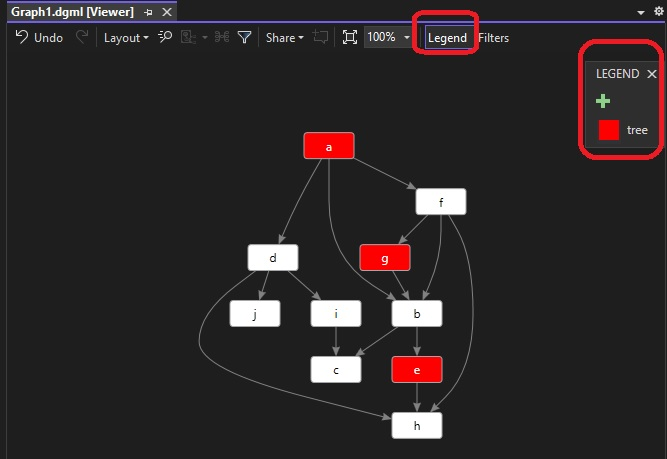
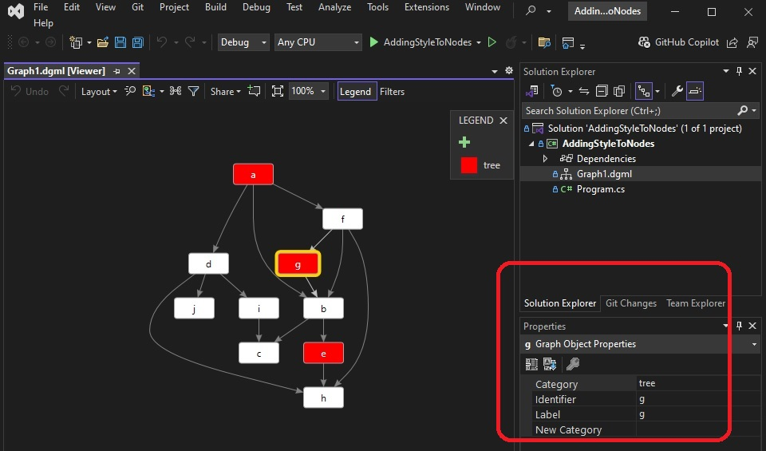

# Exploring dgml file.

## Notes

1. This example, extends earlier example. In a new dgml file, add the following.

```xml
<Links>
    <Link Source="a" Target="b" />
    <Link Source="b" Target="c" />    
    <Link Source="b" Target="e" />    
    <Link Source="a" Target="f" />    
    <Link Source="f" Target="g" />    
    <Link Source="f" Target="h" />    
    <Link Source="a" Target="d" />    
    <Link Source="d" Target="i" />    
    <Link Source="d" Target="j" />
    <Link Source="f" Target="b" />
    <Link Source="g" Target="b" />    
    <Link Source="e" Target="h" />    
    <Link Source="i" Target="c" />    
    <Link Source="d" Target="h" />
</Links> 
```

2. From visual studio 2022, Ctrl + Click to select multiple nodes. Select a, g, e. Add color flag as follows



3. Observe the dgml file. Those selected nodes(a, g, e) have a category added to it. 

```xml
<Nodes>
    <Node Id="a" Category="Category2" Bounds="120,0,50,25.96" Label="a" />
    <Node Id="e" Category="Category2" Bounds="32,223.84,50,25.96" Label="e" />
    <Node Id="g" Category="Category2" Bounds="64,111.92,50,25.96" Label="g" />
</Nodes>
```

```xml
<Categories>
  <Category Id="Category2" Label="Category 2" Background="#FF339933" IsTag="True" />
</Categories>
```
And a style is also added to the category as follows.
```xml
<Styles>
  <Style TargetType="Node" GroupLabel="Category 2" ValueLabel="Has category">
    <Condition Expression="HasCategory('Category2')" />
    <Setter Property="Background" Value="#FF339933" />
  </Style>
</Styles>
```

4. You can change the background color in the style

```xml
<Styles>
  <Style TargetType="Node" GroupLabel="Category 2" ValueLabel="Has category">
    <Condition Expression="HasCategory('Category2')" />
    <Setter Property="Background" Value="Red" />
  </Style>
</Styles>
```

5. You can also change the lable of that category `Category 2` to say `tree`. Click on the legend as follows and it will show tree as follows.




6. Select any node, then open its property window(Ctrl + W, P or View -> Property window)



7. 

## References
1. https://youtu.be/wIjCdOrZj-I?t=305
